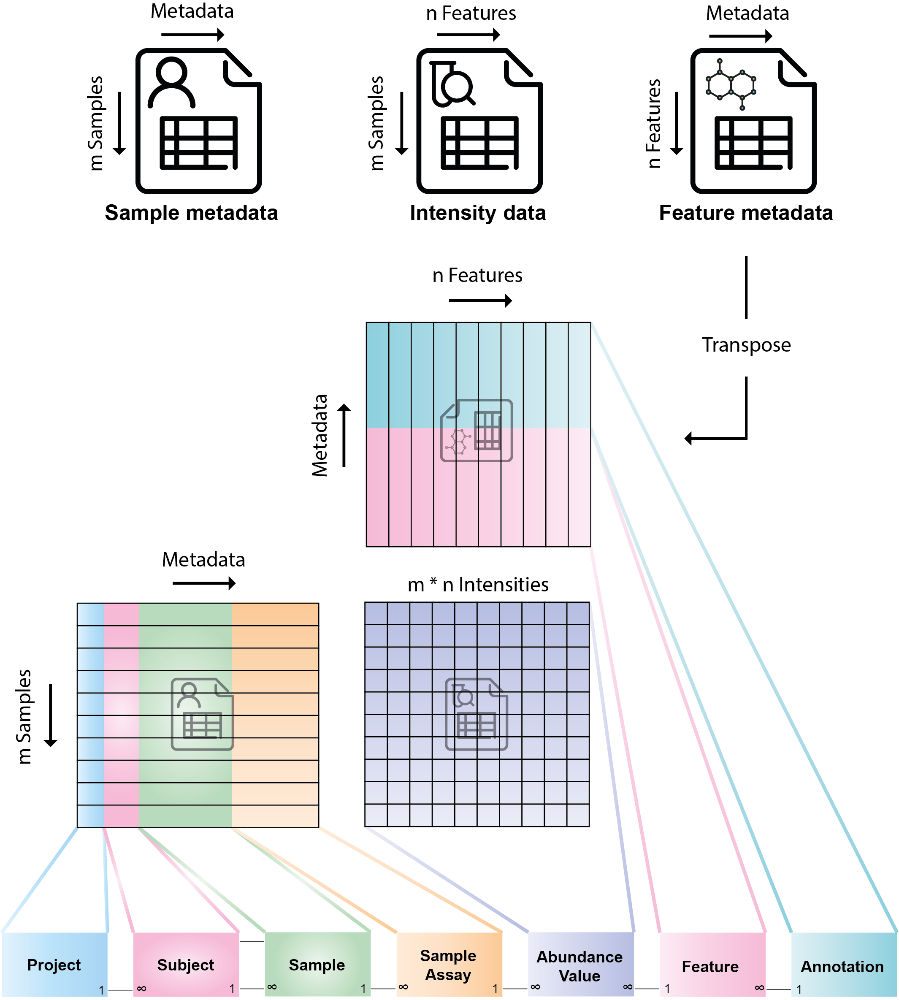

phenomedb.imports
=================

  Mappings between a 3-file format metabolomics dataset and the PhenomeDB core data model

Main import tasks
-----------------

A. ImportMetadata - import sample metadata from a CSV where rows are samples and columns are metadata fields
B. ImportBrukerIVDrAnnotations - import annotated metabolite measurements/abundances from a Bruker IVDr NMR dataset.
C. ImportPeakPantheRAnnotation - import annotated metabolite measurements/abundances from a PeakPantheR LC-MS dataset.
D. ImportMetabolights - import metabolite features and annotations from Metabolights format

.. figure:: ./_images/import-task-overview.png
  :width: 500
  :alt: ImportTask overview

  Overview of the ImportTask class structure. All ImportTasks inherit this transactional-validation approach.

.. automodule:: phenomedb.imports
   :members:
