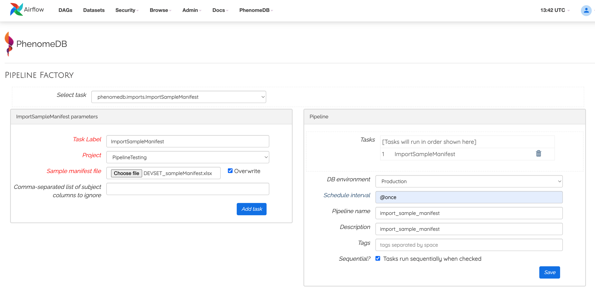

phenomedb.pipeline_factory
==========================

Pipelines can be created, registered with Airflow, and executed via the PipelineFactory. Using this approach removes the requirements for manually writing Airflow DAG files.

.. figure:: ./_images/pipeline-factory-overview.png
  :width: 500
  :alt: PhenomeB PipelineFactory Overview

  Overview of how the PipelineFactory can be used to create Apache Airflow pipelines

  Example of using a the PipelineFactory UI to create a parameterised pipeline

.. automodule:: phenomedb.pipeline_factory
   :members:
