Usage
=====

PhenomeDB is a database, data processing, and analysis and visualisation platform for metabolomics data. The general usage of which is outlined below, where users import data, harmonise the data, build queries to integrate and stratify the data, scale, normalise, and batch correct the data, and run analyses and reports to analyse, visualise, and interpret the data. PhenomeDB provides python APIs and web-based UIs for these steps, including a novel QueryFactory for building and executing queries, and a novel PipelineFactory for building and executing pipelines via Apache-Airflow.

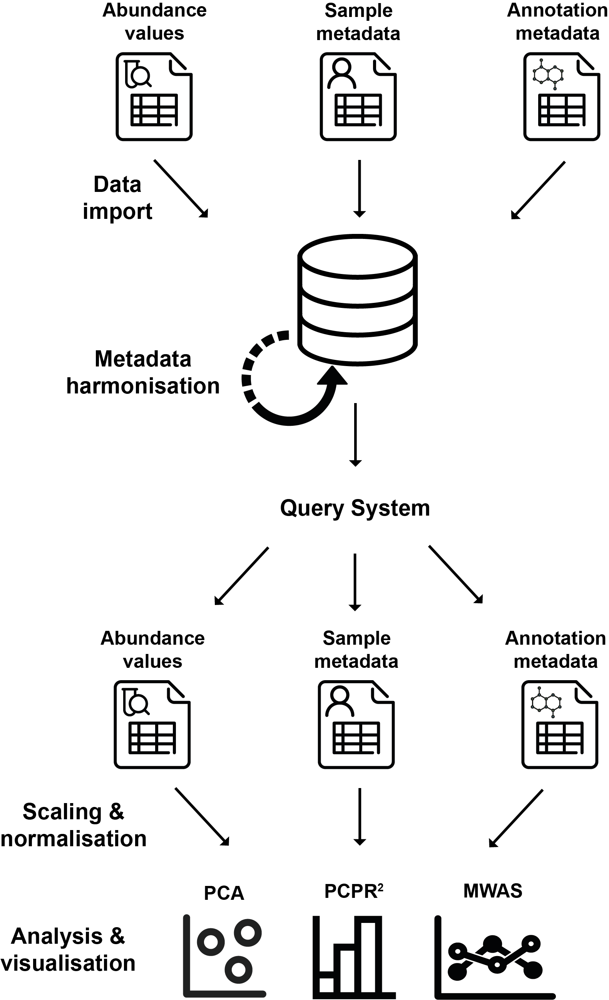

  Overview of using PhenomeDB, including import, harmonisation, querying, scaling/normalisation, and analysis/visualisation.

Tasks
-----

PhenomeDB is structured around the concept of a :ref:`phenomedb.task`. Tasks are units of work that execute a specific function, such as importing annotations, harmonising metadata, or generating datasets on the basis of defined Queries. Tasks can be executed independently, or chained together into Pipelines using the PipelineFactory python API or UI. A full list of included Tasks is shown below, and guides to implementing new tasks can be in :ref:`development`.

The inbuilt tasks for PhenomeDB are shown below. To view their parameters, follow the links to the relevant documentation page:

.. list-table:: Title
   :widths: 50 50
   :header-rows: 1

   * - Task class
     - Task description
   * - :func:`phenomedb.imports.ImportMetadata`
     - Import a CSV sample metadata file
   * - :func:`phenomedb.imports.ImportSampleManifest`
     - Import a Sample Manifest file
   * - :func:`phenomedb.imports.ImportDataLocations`
     - Import a data locations file (deprecated)
   * - :func:`phenomedb.imports.ImportBrukerIVDRAnnotations`
     - Import Bruker IVDr annotations
   * - :func:`phenomedb.imports.ImportPeakPantherAnnotations`
     - Import PeakPantheR annotations
   * - :func:`phenomedb.imports.ImportTargetLynxAnnotations`
     - Import TargetLynx annotations
   * - :func:`phenomedb.imports.XCMSFeatureImportTaskUnifiedCSV`
     - Import XCMS features
   * - :func:`phenomedb.imports.ImportMetabolightsStudy`
     - Import a Metabolights study
   * - :func:`phenomedb.imports.DownloadMetabolightsStudy`
     - Download a Metabolights study
   * - :func:`phenomedb.metadata.HarmoniseMetadataField`
     - Harmonise/curate a metadata field
   * - :func:`phenomedb.analysis.RunPCA`
     - Run a PCA analysis
   * - :func:`phenomedb.analysis.RunPCPR2`
     - Run a PCPR2 analysis
   * - :func:`phenomedb.analysis.RunMWAS`
     - Run an MWAS analysis
   * - :func:`phenomedb.analysis.RunNPYCReport`
     - Run an nPYc report
   * - :func:`phenomedb.analysis.RunXCMS`
     - Run XCMS
   * - :func:`phenomedb.batch_correction.RunCombatCorrection`
     - Run COMBAT correction
   * - :func:`phenomedb.batch_correction.RunNormResidualsMM`
     - Run NormResidualsMixedModel correction
   * - :func:`phenomedb.batch_correction.RunNPYCBatchCorrection`
     - Run LOWESS correction
   * - :func:`phenomedb.batch_correction.SaveBatchCorrection`
     - Save a LOWESS corrected dataset
   * - :func:`phenomedb.compounds.ParseKEGGtoPubchemCIDTask`
     - Parse KEGG to a PubChem CID lookup CSV file
   * - :func:`phenomedb.compounds.ParseHMDBXMLtoCSV`
     - Parse HMDB XML to a lookup CSV file
   * - :func:`phenomedb.compounds.UpdateCompoundRefs`
     - Look for and update the external database refs for existing compounds
   * - :func:`phenomedb.compounds.AddMissingClassyFireClasses`
     - Look for and update the ClassyFire classes for existing compounds
   * - :func:`phenomedb.compounds.CleanROIFile`
     - Clean an ROI file by checking the data matches online databases
   * - :func:`phenomedb.compounds.ImportROICompounds`
     - Import compounds from a PeakPantheR ROI file
   * - :func:`phenomedb.compounds.ImportBrukerBILISACompounds`
     - Import Bruker BI-LISA lipoprotein and lipid fractions from a source file
   * - :func:`phenomedb.compounds.ImportBrukerBiQuantCompounds`
     - Import Bruker Bi-Quant-P compounds from a source file
   * - :func:`phenomedb.compounds.ExportCompoundsToCSV`
     - Export all compounds to CSV
   * - :func:`phenomedb.pipelines.RebuildPipelinesFromDB`
     - Rebuild the Airflow pipelines based on the DB entries
   * - :func:`phenomedb.pipelines.GenerateSingleTaskPipelines`
     - Build the single-task pipelines for single-task execution
   * - :func:`phenomedb.pipelines.BasicSetup`
     - Run the BasicSetup to populate the database with assays, projects, annotation methods etc
   * - :func:`phenomedb.pipelines.BatchCorrectionAssessmentPipelineGenerator`
     - Build the BatchCorrectionAssessmentPipeline
   * - :func:`phenomedb.pipelines.RunBatchCorrectionAssessmentPipeline`
     - Run the BatchCorrectionAssessmentPipeline
   * - :func:`phenomedb.pipelines.RunMWASMulti`
     - Run multiple MWAS
   * - :func:`phenomedb.pipelines.ImportAllMetabolightsPipelineGenerator`
     - Build a pipeline to import all data from Metabolights
   * - :func:`phenomedb.task.ManualSQL`
     - Execute manual SQL
   * - :func:`phenomedb.cache.CreateSavedQueryDataframeCache`
     - Create a SavedQuery Combined dataframe cache
   * - :func:`phenomedb.cache.CreateSavedQuerySummaryStatsCache`
     - Create a SavedQuery summary stats cache
   * - :func:`phenomedb.cache.CreateTaskViewCache`
     - Create the task-view cache (deprecated)
   * - :func:`phenomedb.cache.RemoveUntransformedDataFromCache`
     - Remove untransformed data from the cache (clean up task)
   * - :func:`phenomedb.cache.MoveTaskOutputToCache`
     - Move the task output from the db to cache (clean up task)

For more information on tasks, including implementing your own, please head over to the :ref:`_development` page.

The Apache-Airflow interface
----------------------------

To access Apache-Airflow, once the system is running, open your web browser and navigate to http://localhost:8080/. The default username and password are admin and testpass.

From here, pipelines ('DAGs' in Airflow) for individual tasks can be parameterised, executed, and monitored, and the various PhenomeDB views can be accessed.

Apache-Airflow is structured around the concepts of pipelines and pipeline runs (executions). You parameterise a pipeline run and then Airflow manages the execution. Output logs for each task in the pipeline can be inspected via the interface.

For more information regarding the usage of Apache-Airflow, please see the Apache-Airflow documentation.

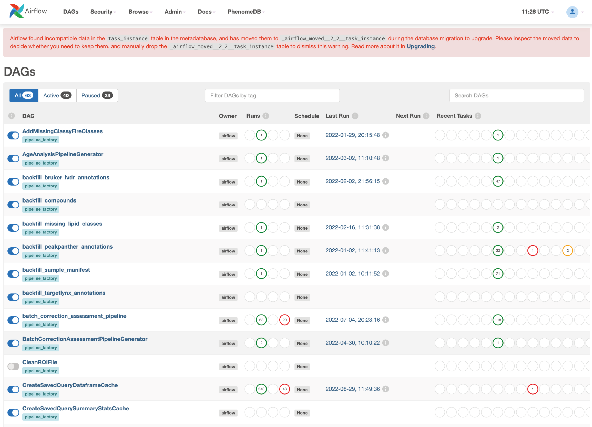

  Airflow home page showing registered pipelines (DAGs)

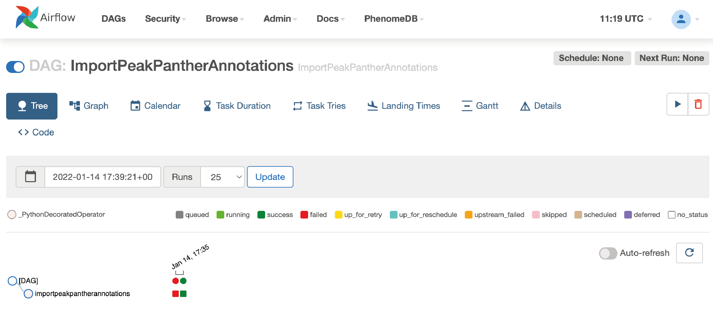

  Graphical view of the ImportPeakPantherAnnotations pipeline

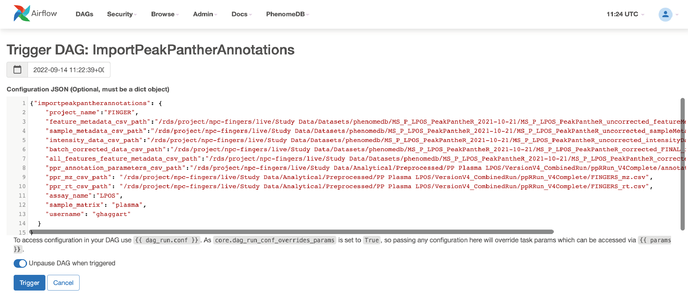

  View for running a pipeline, with example JSON for parameterising the import task.

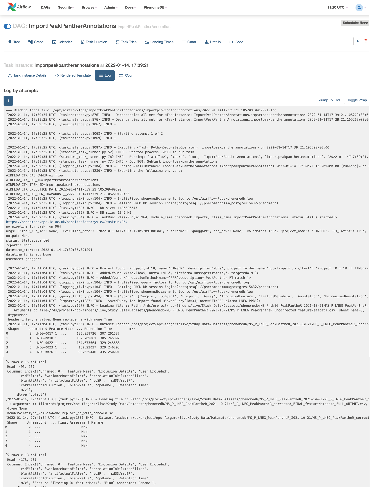

  Example output of the TaskRun logs, viewed from within the Airflow interface

Tasks and Pipelines
-------------------

Pipelines can be created, registered with Airflow, and executed via the PipelineFactory. Using this approach removes the requirements for manually writing Airflow DAG files.

See the :ref:`phenomedb.pipeline_factory` for more information, including how to build and execute pipelines via the python API and the UI.

Importing analytical data and sample metadata
---------------------------------------------

Two main analytical data import sources are supported - Metabolights format, and the nPYc-toolbox 3-file format, consisting of 3 separate sources of information:

A. Sample manifests: CSV files containing sample metadata subject as clinical factors, outcomes-of-interest, or covariates.
B. Feature metadata: CSV files containing feature metadata such as RT, m/z, and other feature-specific analytical metadata.
C. Study data files: CSV files containing analytical features (measurements) relating to the samples and features/annotated compounds.

.. list-table:: Title
   :widths: 50 50
   :header-rows: 1

   * - Task class
     - Task description
   * - :func:`phenomedb.imports.ImportMetadata`
     - Import a CSV sample metadata file
   * - :func:`phenomedb.imports.ImportSampleManifest`
     - Import a Sample Manifest file
   * - :func:`phenomedb.imports.ImportDataLocations`
     - Import a data locations file (deprecated)
   * - :func:`phenomedb.imports.ImportBrukerIVDRAnnotations`
     - Import Bruker IVDr annotations
   * - :func:`phenomedb.imports.ImportPeakPantherAnnotations`
     - Import PeakPantheR annotations
   * - :func:`phenomedb.imports.ImportTargetLynxAnnotations`
     - Import TargetLynx annotations
   * - :func:`phenomedb.imports.XCMSFeatureImportTaskUnifiedCSV`
     - Import XCMS features
   * - :func:`phenomedb.imports.ImportMetabolightsStudy`
     - Import a Metabolights study
   * - :func:`phenomedb.imports.DownloadMetabolightsStudy`
     - Download a Metabolights study

Harmonising sample metadata
---------------------------

In order to compare, integrate, and stratify data across multiple cohorts, the sample metadata must be harmonised. To do this, it is recommended to use the CurateMetadataTask, which enables the curation of unharmonised 'raw' metadata fields and values into harmonised 'curated' metadata fields and values. Please see the :ref:`metadata` module for more information.

.. list-table:: Title
   :widths: 50 50
   :header-rows: 1

   * - Task class
     - Task description
     * - :func:`phenomedb.metadata.HarmoniseMetadataField`
     - Harmonise/curate a metadata field

Importing compound metadata
---------------------------

PhenomeDB enables the storage of annotation metadata such as chemical references and classes, and has a data model and import processes capable of harmonising annotations to their analytical specificity.

The minimum information required for import is compound name (as annotated) and InChI (if available). If the specificity of the annotation is low, multiple compounds and InChIs can be recorded per annotation. With this minimum information, PhenomeDB can lookup and record the following external references and classes and make them queryable and reportable.

Databases: PubChem, ChEBI, ChEMBL, ChemSpider, LipidMAPS, HMDB

Classes: LipidMAPS, HMDB, ClassyFIRE

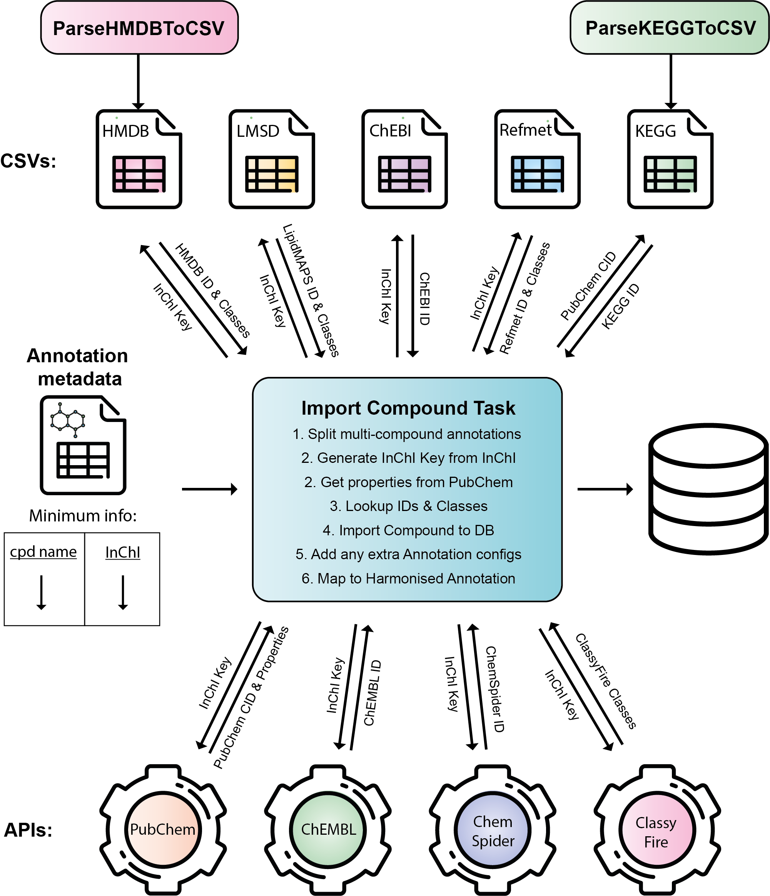

  The ImportCompoundTask overview, which looks up compound metadata and populates the database

Compound metadata can be imported from PeakPantheR region-of-interest files (ROI) files for LC-MS annotations. Recent versions for these can be found in ./data/compounds/.

To import the ROI compound data use the tasks ImportROICompounds and ImportROILipids

IVDr annotation metadata can be imported using ImportBrukerBiLISACompounds and ImportBrukerBiQuantCompounds,. The source data are available in ./data/compounds/

Once imported, compounds and compound classes can be explored using the Compound View UI.

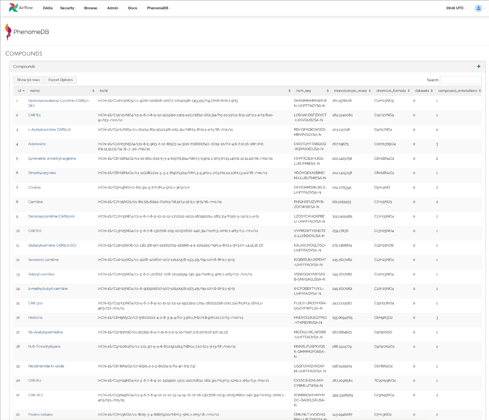

  The Compound List View, showing a searchable, paginated table of imported compounds

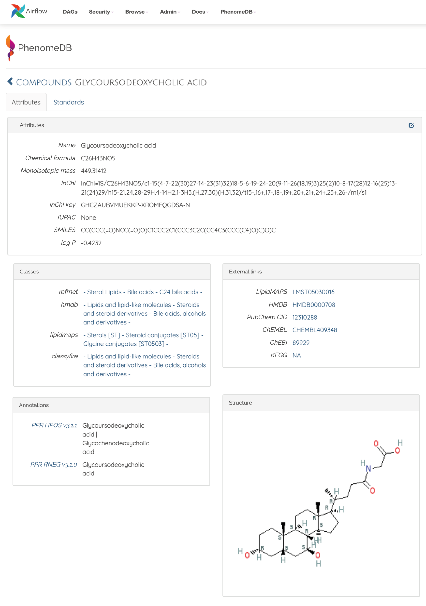

  The Compound View, showing the imported information for one compound, with links to external databases

.. list-table:: Title
   :widths: 50 50
   :header-rows: 1

   * - Task class
     - Task description
   * - :func:`phenomedb.compounds.ParseKEGGtoPubchemCIDTask`
     - Parse KEGG to a PubChem CID lookup CSV file
   * - :func:`phenomedb.compounds.ParseHMDBXMLtoCSV`
     - Parse HMDB XML to a lookup CSV file
   * - :func:`phenomedb.compounds.UpdateCompoundRefs`
     - Look for and update the external database refs for existing compounds
   * - :func:`phenomedb.compounds.AddMissingClassyFireClasses`
     - Look for and update the ClassyFire classes for existing compounds
   * - :func:`phenomedb.compounds.CleanROIFile`
     - Clean an ROI file by checking the data matches online databases
   * - :func:`phenomedb.compounds.ImportROICompounds`
     - Import compounds from a PeakPantheR ROI file
   * - :func:`phenomedb.compounds.ImportBrukerBILISACompounds`
     - Import Bruker BI-LISA lipoprotein and lipid fractions from a source file
   * - :func:`phenomedb.compounds.ImportBrukerBiQuantCompounds`
     - Import Bruker Bi-Quant-P compounds from a source file
   * - :func:`phenomedb.compounds.ExportCompoundsToCSV`
     - Export all compounds to CSV

Harmonising annotation metadata
-------------------------------

In order to integrate annotations across projects, the annotations must be harmonised. PhenomeDB will attempt to do this automatically where possible, however in some cases it is necessary to manually harmonise annotations. To do this use the 'Harmonise Annotations' view.

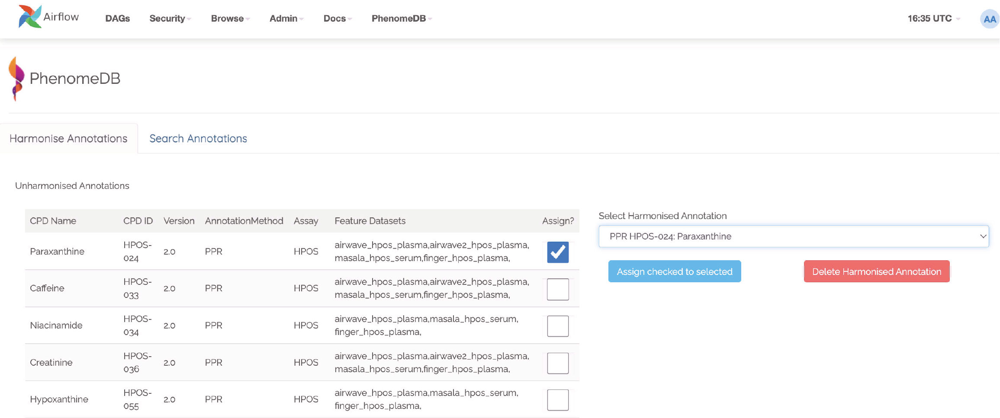

  The Harmonise Annotations View, where unharmonised annotations can be harmonised manually to enable cross-project comparisons

Creating and executing queries
------------------------------

PhenomeDB has a complex and rich querying system that enables users to define queries as a collection of filters and the conversion of the results of those filters to a dataset, enabling cross-project integration and stratification. For more information on the QueryFactory, including its Python API and UI, please head over to :ref:`imports`.

In short, users define queries, build the dataframe cache, and then that cache can be used in downstream analyses/tasks.

Scaling, normalisation, and batch correction
--------------------------------------------

In order to compare metabolite levels across different batches, projects, or assays, scaling/normalisation, transformation, and batch correction must be undertaken. The aim of these methods is to minimise inter-batch technical variation while maintaining inter-sample biological variation.

Two kinds of intensity values are stored in the database, raw, and SR-corrected. Raw are the 'raw', peak-picked intensities from the instruments. 'SR-corrected' is data that has been run-order corrected using study-reference QC-based LOWESS correction. Typically LC-MS data will need to be run-order corrected so it is advisable to use this SR-corrected data for LC-MS datasets.

Batch correction can be undertaken using the following tasks:

.. list-table:: Title
   :widths: 50 50
   :header-rows: 1

   * - Task class
     - Task description
   * - :func:`phenomedb.batch_correction.RunCombatCorrection`
     - Run COMBAT correction
   * - :func:`phenomedb.batch_correction.RunNormResidualsMM`
     - Run NormResidualsMixedModel correction
   * - :func:`phenomedb.batch_correction.RunNPYCBatchCorrection`
     - Run LOWESS correction
   * - :func:`phenomedb.batch_correction.SaveBatchCorrection`
     - Save a LOWESS corrected dataset

When running analyses, the following scaling and transformations can be executed as options to the analysis methods.

.. list-table:: Title
   :widths: 50 50
   :header-rows: 1

   * - Scaling methods
     - Transform methods
   * - Mean-centred (mc)
     - Log10 (log)
   * - Unit-variance (uv)
     - Square root (sqrt)
   * - Median
     -

Running analyses
----------------

Implemented analysis functions include:

.. list-table:: Title
   :widths: 50 50
   :header-rows: 1

   * - Task class
     - Task description
   * - :func:`phenomedb.analysis.RunPCA`
     - Run a PCA analysis
   * - :func:`phenomedb.analysis.RunPCPR2`
     - Run a PCPR2 analysis
   * - :func:`phenomedb.analysis.RunMWAS`
     - Run an MWAS analysis
   * - :func:`phenomedb.analysis.RunNPYCReport`
     - Run an nPYc report
   * - :func:`phenomedb.analysis.RunXCMS`
     - Run XCMS

Individual analyses can be run via the AnalysisView page, where task runs can be parameterised and scheduled, and the results can be explored.

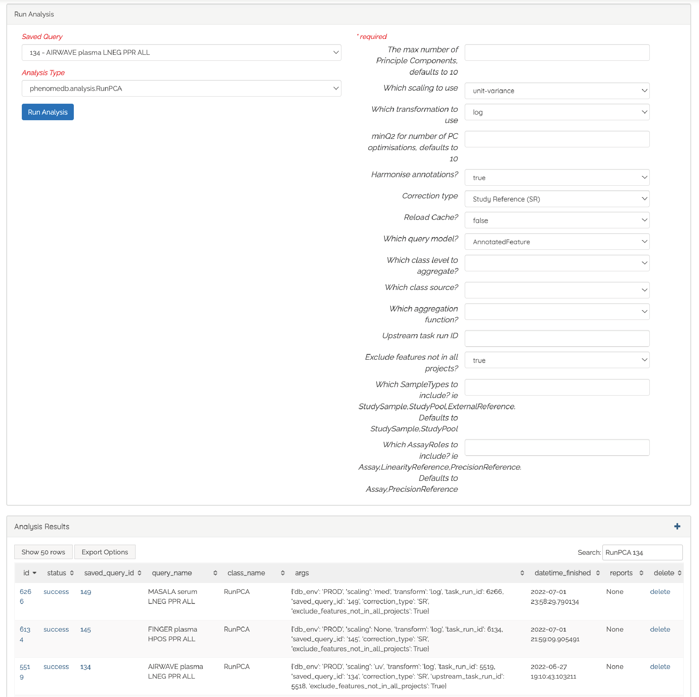

  Analyses can be executed against queries (and upstream task runs) using the AnalysisView. Parameters for the task run can be specified using the html form, including scaling and transformation steps and task-specific options. Previous task runs can be explored via a table.

The results of each analysis can be explored via a dedicated UI, with panels common to all analysis tasks with options to rerun the task, and options to download the input and output datasets.

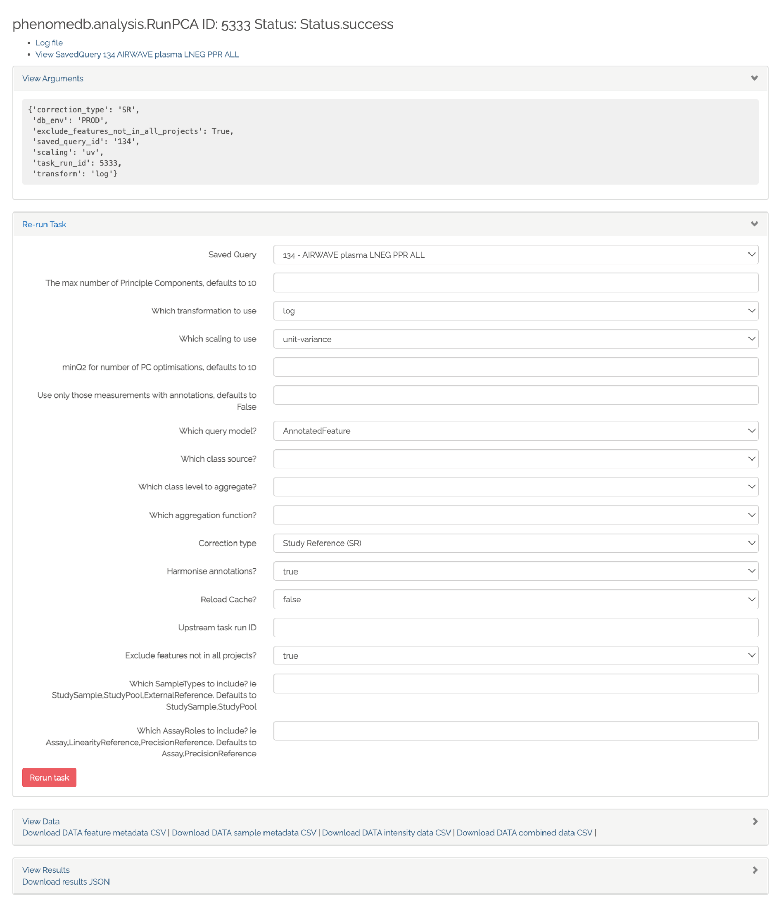

  Each task run output view has the ability to re-run the task with new parameters, and explore and download the input and output datasets.

Each AnalysisTask also has specific charts and figures available to explore the results.

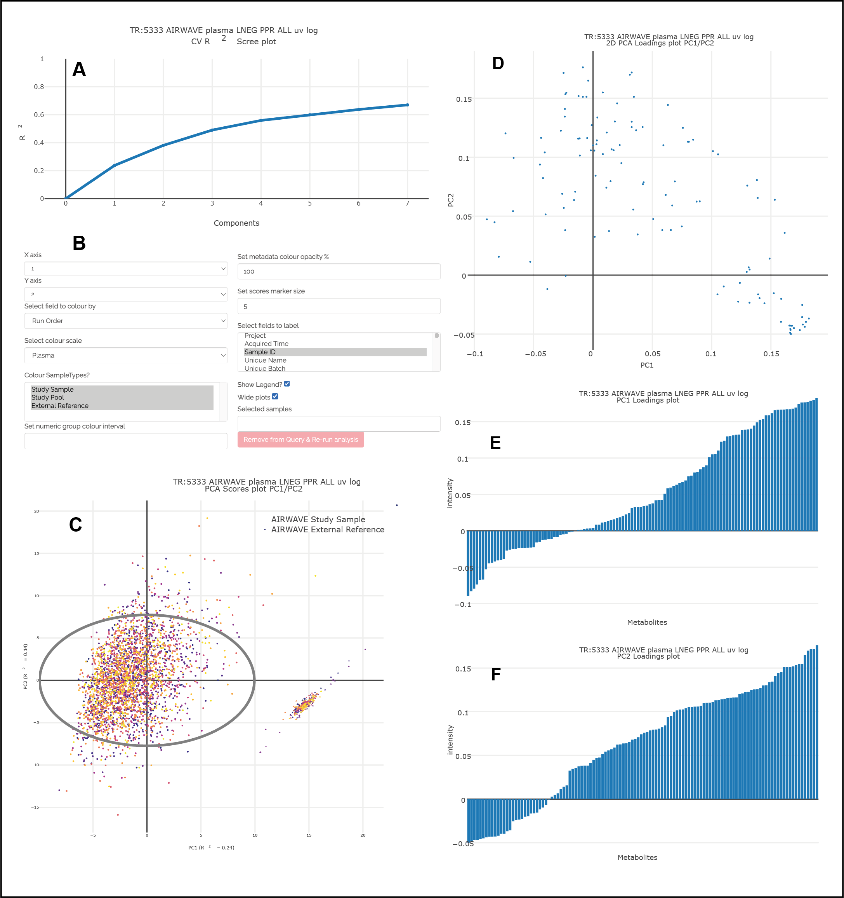

  Interactive visualisation of PCA outputs, including A: Scree plot, B: control panel to control the chart options, C: 2D scores plots, D, E, F: loadings plots.

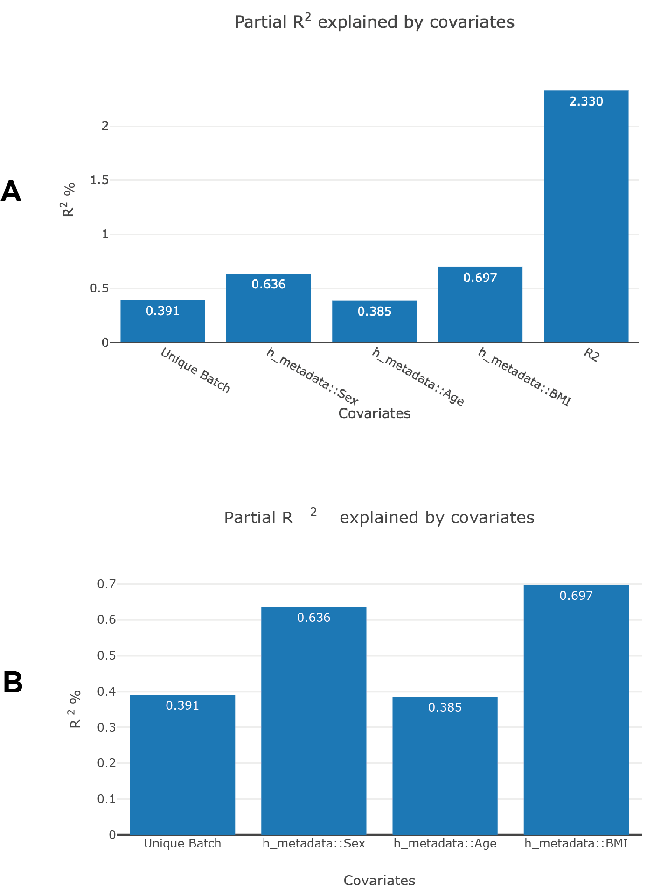

  Visualisation of PCPR2 results

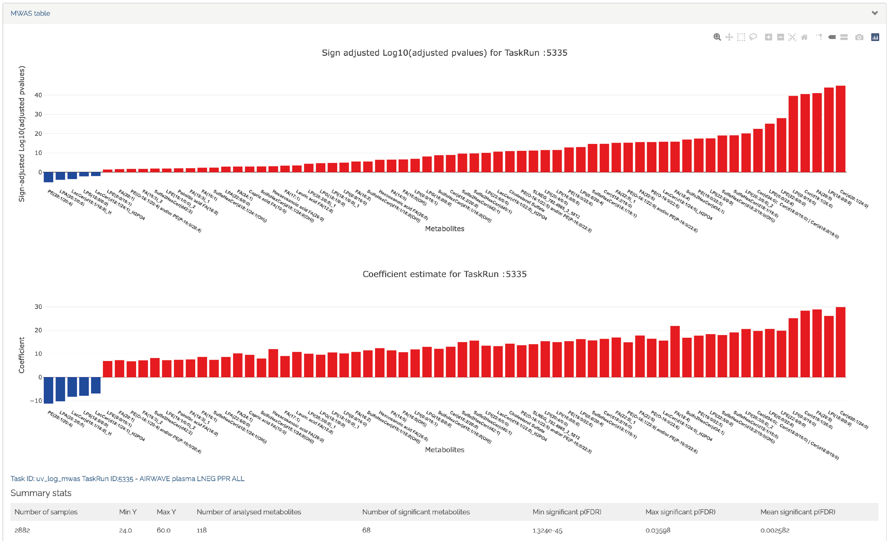

  Interactive visualisation of 1D MWAS outputs

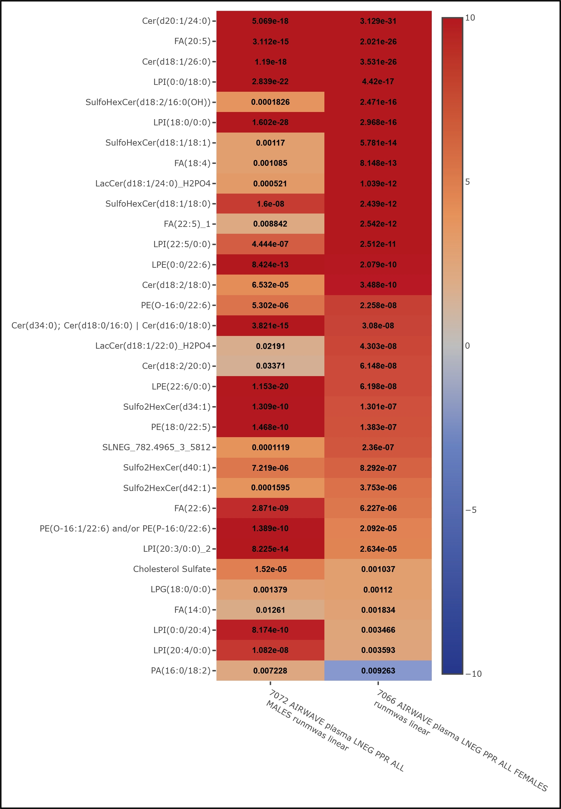

  Interactive visualisation of MWAS comparison heatmaps, where the results of two MWAS analyses can be compared, in this case comparing the age-associated metabolites of males and females

