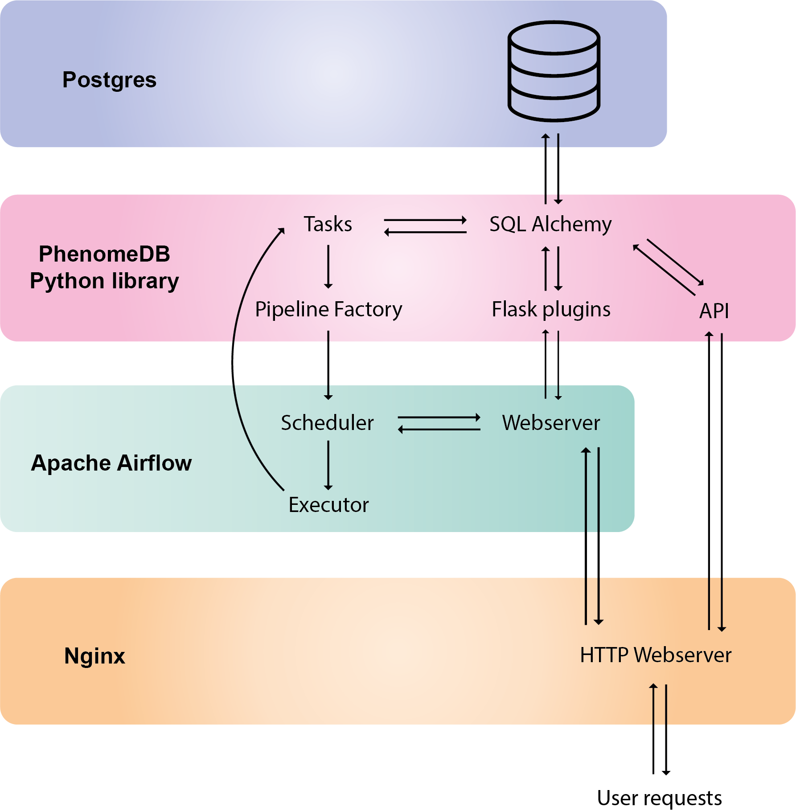
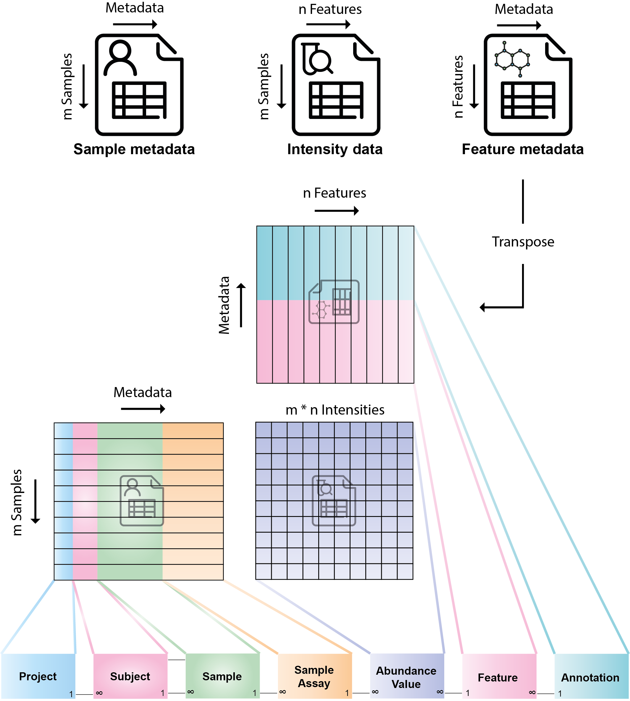
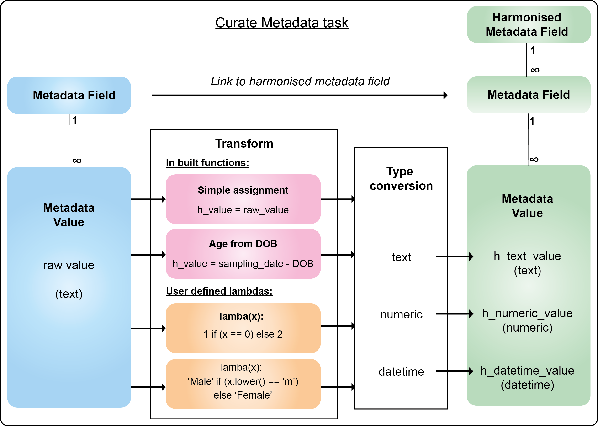
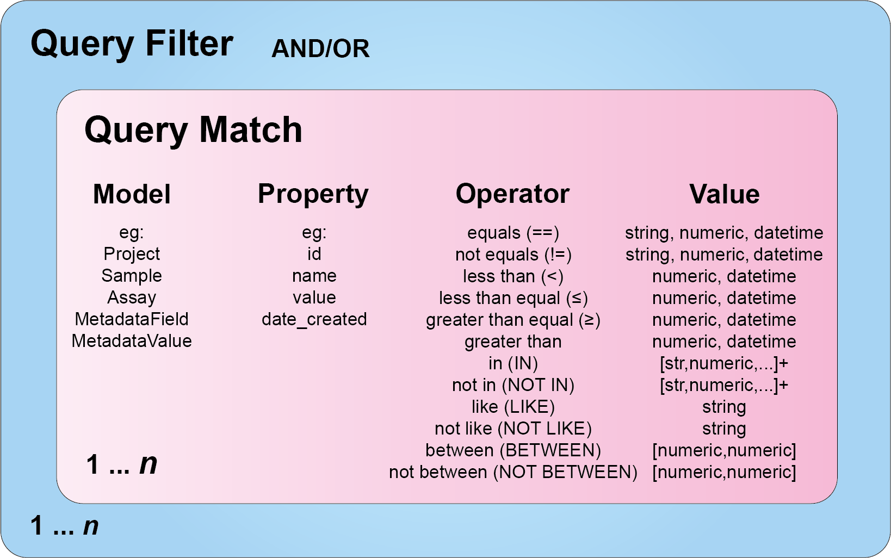
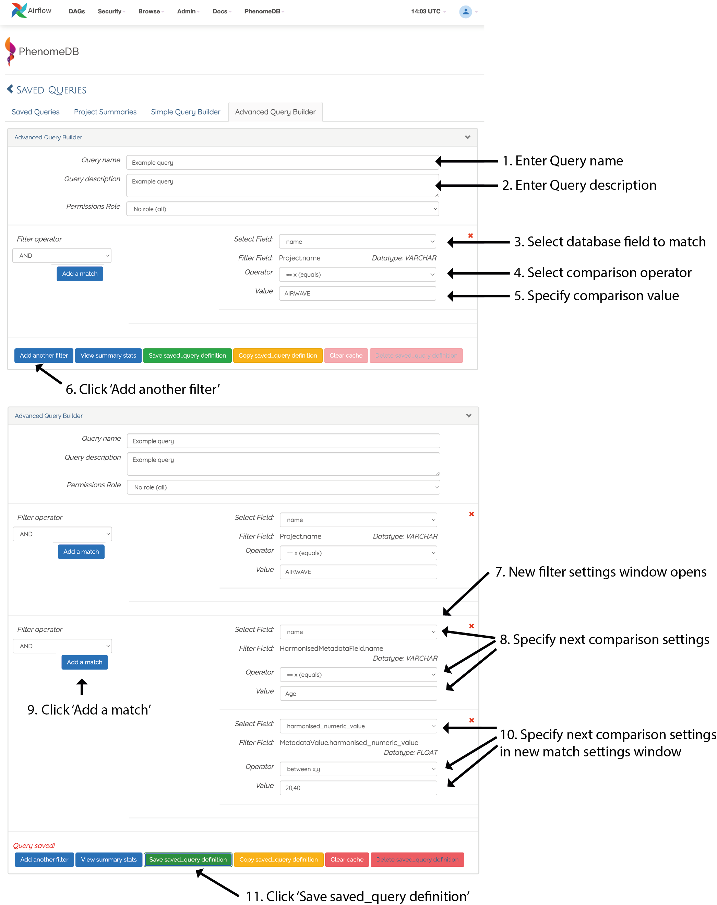
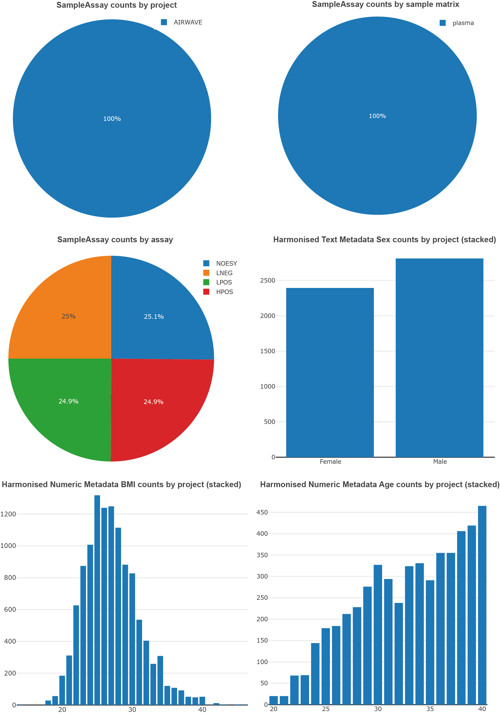
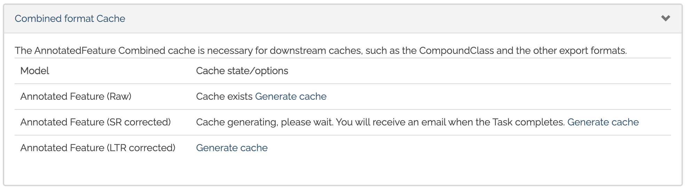
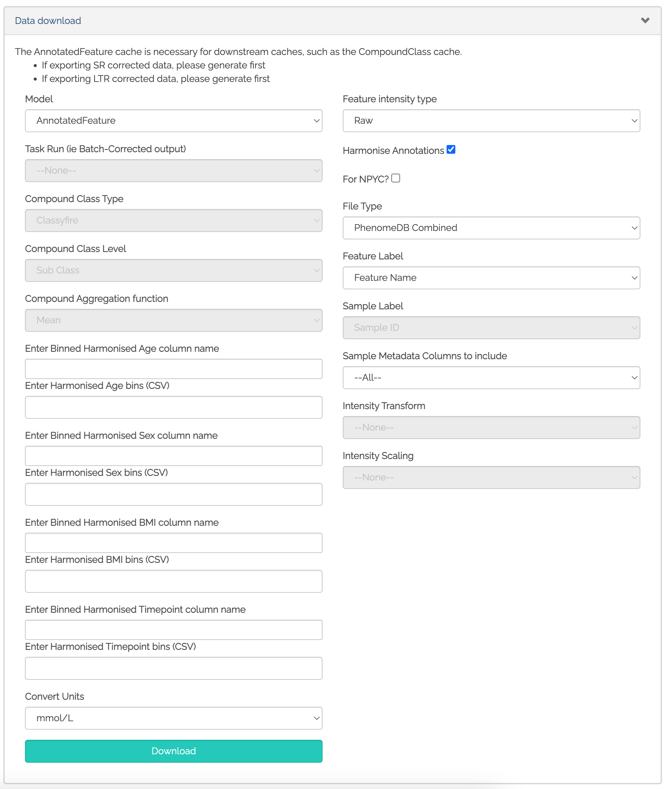
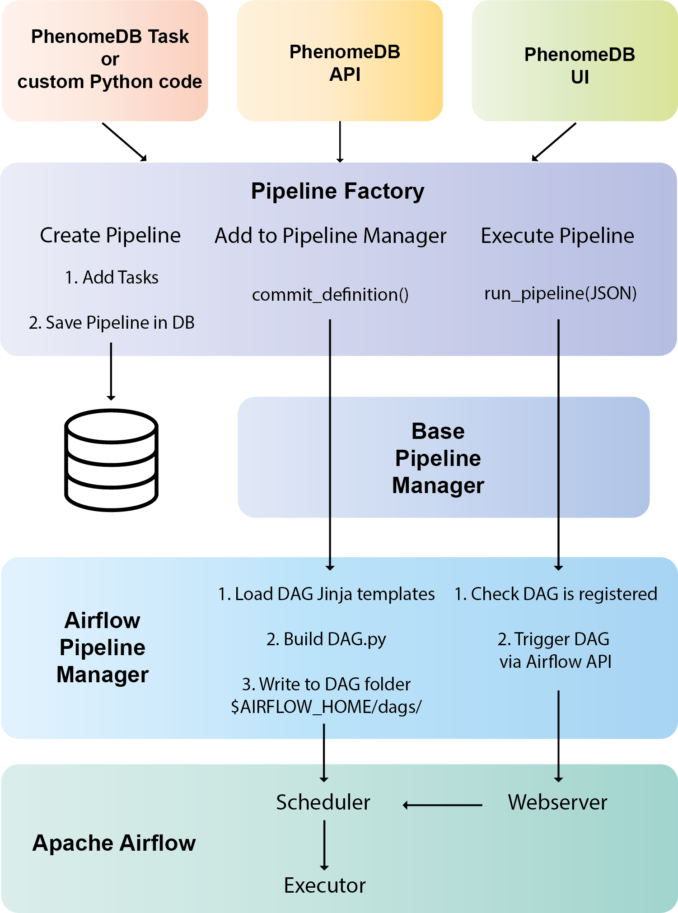
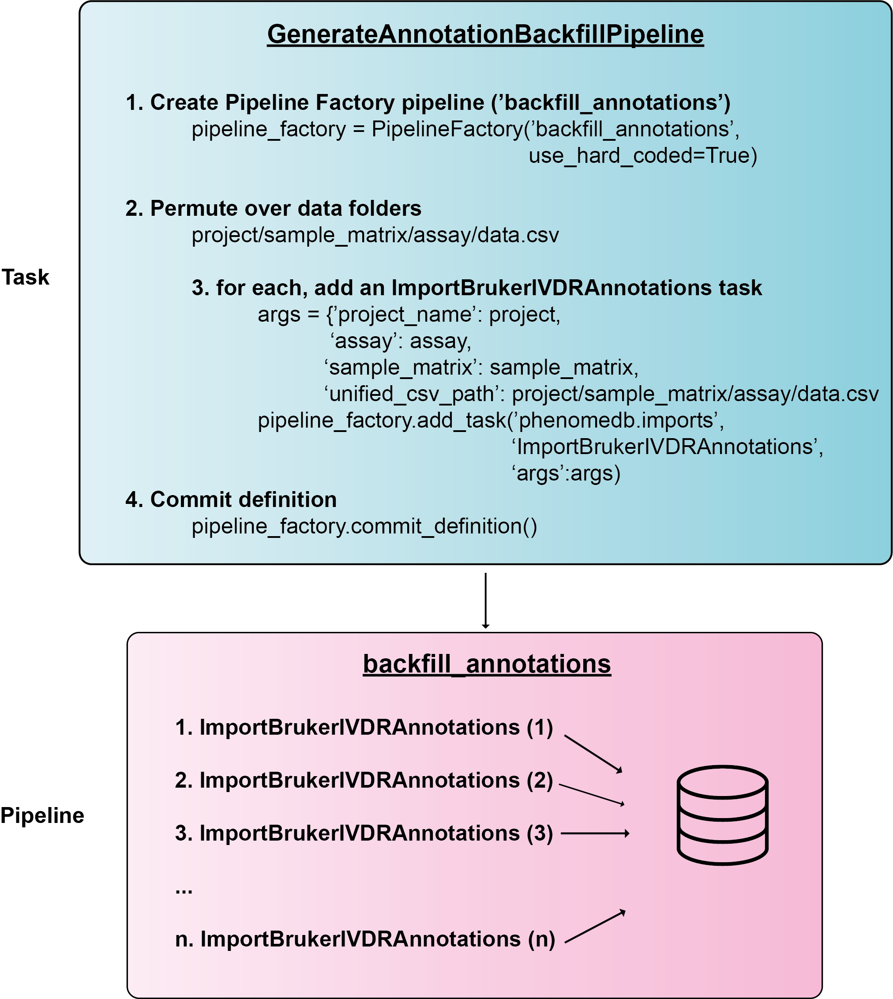

.. _usage:

Usage
=====

PhenomeDB is a database, data processing, and analysis and visualisation platform for metabolomics data. The general usage of which is outlined below, where users import data, harmonise the data, build queries to integrate and stratify the data, scale, normalise, and batch correct the data, and run analyses and reports to analyse, visualise, and interpret the data. PhenomeDB provides python APIs and web-based UIs for these steps, including a novel QueryFactory for building and executing queries, and a novel PipelineFactory for building and executing pipelines via Apache-Airflow.

.. figure:: ./_images/method-development-overview.png
  :width: 400
  :alt: PhenomeDB usage overview

  Overview of using PhenomeDB, including import, harmonisation, querying, scaling/normalisation, and analysis/visualisation.

Core platform architecture
--------------------------
PhenomeDB is a relatively complex application consisting of the following sub-systems:

A. Postgres database
B. Python library with modules for importing, harmonising, querying, normalising, and analysing the data. The code in these modules is organised into 'tasks' that can be chained together into pipelines using the PipelineFactory.
C. Redis cache (with a file-system backend extension) for storing query sets and analysis results
D. Apache-Airflow for running pipelines
E. Flask plugins for exploring the data, building queries, running analyses, and visualising results

  PhenomeDB core architectural components (note that important components Redis and the file-system are not shown here)

The Apache-Airflow interface
----------------------------

To access Apache-Airflow, once the system is running, open your web browser and navigate to http://localhost:8080/. The default username and password are admin and testpass.

From here, pipelines ('DAGs' in Airflow) for individual tasks can be parameterised, executed, and monitored, and the various PhenomeDB views can be accessed.

Apache-Airflow is structured around the concepts of pipelines and pipeline runs (executions). You parameterise a pipeline run and then Airflow manages the execution. Output logs for each task in the pipeline can be inspected via the interface.

For more information regarding the usage of Apache-Airflow, please see the Apache-Airflow documentation.

.. figure:: ./_images/airflow-ui-1.png
  :width: 600
  :alt: Airflow UI home

  Airflow home page showing registered pipelines (DAGs)

.. figure:: ./_images/airflow-ui-2.png
  :width: 600
  :alt: Airflow Pipeline Overview

  Graphical view of the ImportPeakPantherAnnotations pipeline

.. figure:: ./_images/airflow-ui-3.png
  :width: 600
  :alt: Airflow Run Pipeline

  View for running a pipeline, with example JSON for parameterising the import task.

.. figure:: ./_images/airflow-ui-4.png
  :width: 600
  :alt: Airflow Logs example

  Example output of the TaskRun logs, viewed from within the Airflow interface

Importing analytical data and sample metadata
---------------------------------------------

Two main analytical data import sources are supported - Metabolights format, and the nPYc-toolbox 3-file format, consisting of 3 separate sources of information:

A. Sample manifests: CSV files containing sample metadata subject as clinical factors, outcomes-of-interest, or covariates.
B. Feature metadata: CSV files containing feature metadata such as RT, m/z, and other feature-specific analytical metadata.
C. Study data files: CSV files containing analytical features (measurements) relating to the samples and features/annotated compounds.

  Mappings between a 3-file format metabolomics dataset and the PhenomeDB core data model

Import Tasks:

A. ImportMetadata - import sample metadata from a CSV where rows are samples and columns are metadata fields
B. ImportBrukerIVDrAnnotations - import annotated metabolite measurements/abundances from a Bruker IVDr NMR dataset.
C. ImportPeakPantheRAnnotation - import annotated metabolite measurements/abundances from a PeakPantheR LC-MS dataset.
D. ImportMetabolights - import metabolite features and annotations from Metabolights format

Harmonising sample metadata
---------------------------

In order to compare, integrate, and stratify data across multiple cohorts, the sample metadata must be harmonised. To do this, it is recommended to use the CurateMetadataTask, which enables the curation of unharmonised 'raw' metadata fields and values into harmonised 'curated' metadata fields and values.

  The CurateMetadataTask architecture, with methods for harmonising types, names, and values

Importing compound metadata
---------------------------

PhenomeDB enables the storage of annotation metadata such as chemical references and classes, and has a data model and import processes capable of harmonising annotations to their analytical specificity.

The minimum information required for import is compound name (as annotated) and InChI (if available). If the specificity of the annotation is low, multiple compounds and InChIs can be recorded per annotation. With this minimum information, PhenomeDB can lookup and record the following external references and classes and make them queryable and reportable.

Databases: PubChem, ChEBI, ChEMBL, ChemSpider, LipidMAPS, HMDB

Classes: LipidMAPS, HMDB, ClassyFIRE

.. figure:: ./_images/compound-task-overview.png
  :width: 600
  :alt: PhenomeDB ImportCompoundTask overview

  The ImportCompoundTask overview, which looks up compound metadata and populates the database

Compound metadata can be imported from PeakPantheR region-of-interest files (ROI) files for LC-MS annotations. Recent versions for these can be found in ./data/compounds/.

To import the ROI compound data use the tasks ImportROICompounds and ImportROILipids

IVDr annotation metadata can be imported using ImportBrukerBiLISACompounds and ImportBrukerBiQuantCompounds,. The source data are available in ./data/compounds/

Once imported, compounds and compound classes can be explored using the Compound View UI.

.. figure:: ./_images/compound-list-view.png
  :width: 600
  :alt: PhenomeDB Compound List View

  The Compound List View, showing a searchable, paginated table of imported compounds

.. figure:: ./_images/compound-view-example.png
  :width: 600
  :alt: PhenomeDB Compound View

  The Compound View, showing the imported information for one compound, with links to external databases

Harmonising annotation metadata
-------------------------------

In order to integrate annotations across projects, the annotations must be harmonised. PhenomeDB will attempt to do this automatically where possible, however in some cases it is necessary to manually harmonise annotations. To do this use the 'Harmonise Annotations' view.

.. figure:: ./_images/manual-annotation-harmonisation-view.png
  :width: 600
  :alt: PhenomeDB manual annotation harmonisation

  The Harmonise Annotations View, where unharmonised annotations can be harmonised manually to enable cross-project comparisons

Creating and executing queries
------------------------------

Creating queries can be done either via the Query Factory view or the QueryFactory Python API. In PhenomeDB Queries are created by chaining QueryFilter objects containing boolean operators and QueryMatches, which specifying the fields and comparison operators and values. An overview of this can be seen below. With the collection of QueryFilters and QueryMatches, the QueryFactory then calculates/transpiles the query definition into an SQLAlchemy query, and executes the query. The QueryFactory can then construct a combined-format and 3-file format dataset of the results, and store them in the PhenomeDB Cache, an extended version of Redis that enables file-system persistency of objects. Generating the dataframes can currently take a long time depending on the number of records the query returns, for this reason once the query has been defined the user should run the CreateSavedQueryDataframeCache task to execute the query and set it into the cache. This can be run manually via the interface or via the QueryFactory UI.

  The QueryFilter and QueryMatch architecture. Multiple QueryFilters can be added, each with AND or OR boolean operators. Each QueryFilter can have multiple QueryMatches, targeting a specific Model.property, with a specific comparison operator and value.

An example of using these to construct a query is shown below.

.. code-block:: python

    # Instantiate the QueryFactory
    query_factory = QueryFactory(query_name='Users under 40', query_description='test description')

    # Add a filter with the match properties added in the constructor (default 'AND')
    query_factory.add_filter(model='Project', property='name', operator='eq', value='My Project')

    # Create another filter with the match properties added in the constructor
    filter = QueryFilter(model='HarmonisedMetadataField',property='name',operator='eq', value='Age')

    # Add another match to the filter
    filter.add_match(model='MetadataValue',property='harmonised numeric value',operator='lt', value=40)

    # Add the filter to the query factory (default 'AND')
    query_factory.add_filter(query_filter=filter)

    #4. Save the query in the SavedQuery data model
    query_factory.save_query()

    #5. Generate the summary statistics
    query_factory.calculate_summary_statistics()

    #6. Execute the query, build the 3-file format, load into cache, and return dataframes
    intensity_data = query_factory.load_dataframe('intensity_data',harmonise_annotations=True)
    sample_metadata = query_factory.load_dataframe('sample_metadata',harmonise_annotations=True)
    feature_metadata = query_factory.load_dataframe('feature_metadata',harmonise_annotations=True)

To simplify querying HarmonisedMetadataFields, the following MetadataFilter can be used

.. code-block:: python

    # Instantiate the QueryFactory
    query factory = QueryFactory(query_name='Users under 40', query_description='test description')

    # Add a filter with the match properties added in the constructor (default 'AND')
    query factory.add_filter(QueryFilter(model='Project',property='name',operator='eq',value='My Project'))

    # Add a Metadata filter with the match properties added in the constructor (default 'AND')
    query factory.add_filter(MetadataFilter('Age','lt',value=40))

    #4. Save the query in the SavedQuery data model
    query factory.save_query()

    #5. Generate the summary statistics
    query_factory.calculate_summary_statistics()

    #6. Execute the query, build the 3-file format, load into cache, and return dataframes
    intensity_data = query_factory.load_dataframe('intensity_data',harmonise_annotations=True)
    sample_metadata = query_factory.load_dataframe('sample_metadata',harmonise_annotations=True)
    feature_metadata = query_factory.load_dataframe('feature_metadata',harmonise_annotations=True)

SavedQueries can be created and explored using the QueryFactory user interface. Through the interface the summary statistics for the query can be visually explored to assess the composition of the generated cohort. Once you are happy with the composition you should then execute the CreateSavedQueryDataframeCache task for the SavedQuery to build the query dataframes and store them in the Cache.

  Creating a SavedQuery using the UI.

  The QueryFactory summary stats output.

  Buttons to trigger a CreateSavedQueryDataframe task via the QueryFactory UI

  QueryFactory options for downloading a dataframe. Options include the ability to bin harmonised metadata fields, include or exclude specific columns, and specify the output format.

Scaling, normalisation, and batch correction
--------------------------------------------

In order to compare metabolite levels across different batches, projects, or assays, scaling/normalisation, transformation, and batch correction must be undertaken. The aim of these methods is to minimise inter-batch technical variation while maintaining inter-sample biological variation.

Running analyses
----------------

Implemented analysis functions include:

A. PCA via the RunPCA task
B. PCPR2 via the RunPCPR2 task
C. MWAS via the RunMWAS task
D. nPYc reports via the RunNPYCReport task

Individual analyses can be run via the AnalysisView page, where task runs can be parameterised and scheduled, and the results can be explored.

.. figure:: ./_images/analysis-view-list.png
  :width: 600
  :alt: PhenomeDB AnalysisView list

  Analyses can be executed against queries (and upstream task runs) using the AnalysisView. Parameters for the task run can be specified using the html form, including scaling and transformation steps and task-specific options. Previous task runs can be explored via a table.

The results of each analysis can be explored via a dedicated UI, with panels common to all analysis tasks with options to rerun the task, and options to download the input and output datasets.

.. figure:: ./_images/analysis-view-common.png
  :width: 600
  :alt: PhenomeDB AnalysisView common

  Each task run output view has the ability to re-run the task with new parameters, and explore and download the input and output datasets.

Each AnalysisTask also has specific charts and figures available to explore the results.

.. figure:: ./_images/pca-view.png
  :width: 650
  :alt: PhenomeDB RunPCA visualisation

  Interactive visualisation of PCA outputs, including A: Scree plot, B: control panel to control the chart options, C: 2D scores plots, D, E, F: loadings plots.

.. figure:: ./_images/pcpr2-view-1.png
  :width: 500
  :alt: PhenomeDB RunPCPr2 visualisation

  Visualisation of PCPR2 results

.. figure:: ./_images/MWAS-view-example.png
  :width: 650
  :alt: PhenomeDB RunMWAS visualisation

  Interactive visualisation of 1D MWAS outputs

.. figure:: ./_images/example-lneg-mwas-sex-comparison-consistent.png
  :width: 650
  :alt: PhenomeDB RunMWAS compare visualisation

  Interactive visualisation of MWAS comparison heatmaps, where the results of two MWAS analyses can be compared, in this case comparing the age-associated metabolites of males and females

Tasks and Pipelines
-------------------

Major processing steps including import, harmonisation, integration, analysis are structured into repeatable and reusable 'tasks'. These tasks can then be organised into 'pipelines' using the PipelineFactory and registered to and executed and monitored by Apace-Airflow. When a task is executed it records a TaskRun object in the database with information regarding the parameters used. Task outputs are stored in the persistent cache for later use.

Pipelines can be created, registered with Airflow, and executed via the PipelineFactory. Using this approach removes the requirements for manually writing Airflow DAG files.

  Overview of how the PipelineFactory can be used to create Apache Airflow pipelines

  Example of using a task to create a Pipeline, using the PipelineFactory to chain tasks together and register it with Airflow
